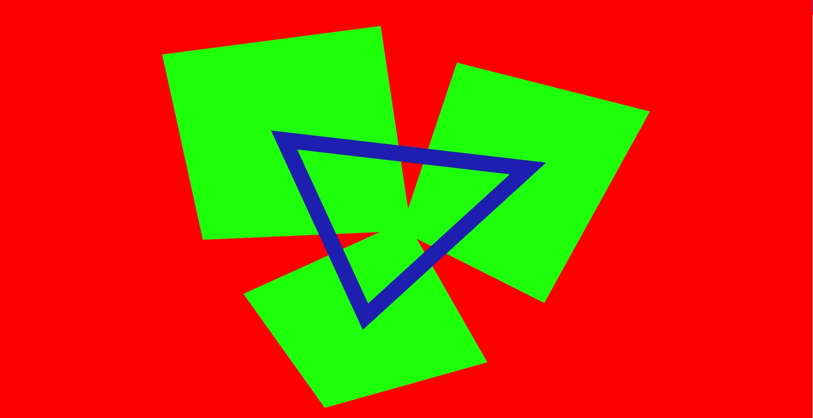
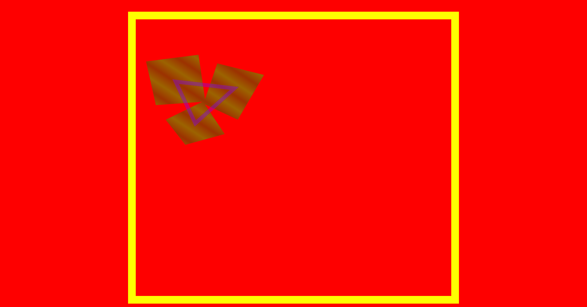
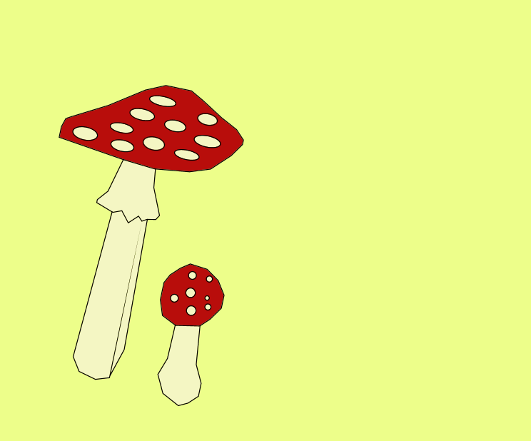
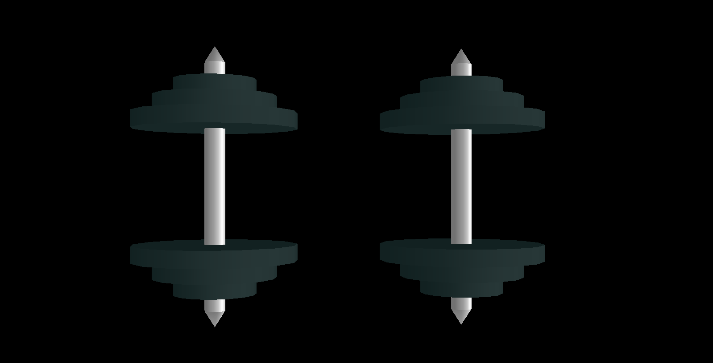

# graphics

## Мар'яненко Роман КП-83. Варіант 11

### Лабораторна робота №1 

### Результат роботи програми 

### Лабораторна робота №2

### Результат роботи програми

### Лабораторна робота №3

### Результат роботи програми

### Лабораторна робота №4

### Результат роботи програми

### Лабораторна робота №5

### Результат роботи програми

### Лабораторна робота №6

### Результат роботи програми

